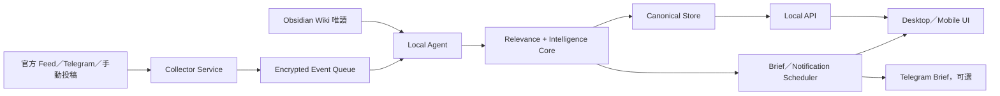

# 個人世界情報系統：Alpha 到可安裝軟體的建構計畫

日期：2026-07-31（America/New_York）

## 結論

Alpha v1.1 已經具備情報資料模型與本機控制迴路，但還不是可交付給一般使用者的軟體。下一步不應先增加更多 Feed，而應先完成三件事：

1. 讓背景引擎不用 Codex、命令列或開啟瀏覽器也能可靠常駐。
2. 讓 Inbox 依使用者興趣、Situation 關聯與決策期限排序，而不是依 Feed 數量淹沒使用者。
3. 把安裝、升級、備份、診斷、權限與解除安裝做成產品能力。

推薦採取「local-first、可選受控 relay」架構。私人 Wiki、判斷、Mission 與 Review 留在本機；未來若需要 PC 關機仍收集，才增加只接收經授權事件的 always-on relay。沒有另外取得使用者授權前，不部署或連接任何外部 relay。

## 第一次真實啟動的觀察

- 本機服務已在 `127.0.0.1:4173` 運行，Live UI 與 collectors 正常。
- Wiki 唯讀索引為合規 Markdown；使用者自訂的永久排除區排除。
- 第一輪 Inbox 有 40 筆：Federal Register 21、CISA 9、UN 7、Fed/BLS/Treasury 各 1。
- FOMC statement 與 BLS CPI 已命中 `situation-us-inflation-fed`，但 materiality 仍為 low；部分未命中使用者興趣的一般法規卻被標成 high。
- 因此目前的主要產品風險不是「收不到資料」，而是 relevance ranking 與 attention budget 尚未可靠。
- C 槽可用空間約 4.9%，runtime health 正確顯示 degraded。正式安裝不能繼續把依賴與 build cache 堆在 OneDrive／C 槽。

## 目標產品形態

使用者看到的是一個 App，但內部拆成四個可獨立恢復的程序邊界：



### 1. Background Engine

- Windows 登入後自動啟動，不依賴 Codex。
- collector、Wiki reconcile、brief generation、retention、backup 分成可觀測工作。
- crash restart、sleep/wake catch-up、單一實例鎖與 graceful shutdown。
- 系統匣顯示 Running／Degraded／Offline，並提供開啟 App、重新同步、暫停收集、匯出診斷。

### 2. Intelligence Core

- 核心物件仍是 `InboxItem → Situation → Mission → Review`。
- Today 與 Brief 維持 projection，不成為第二份真相。
- 建立兩階段 router：先做硬性關聯過濾，再做可解釋排序。
- 排序至少使用：Active Situation、Mission deadline、WatchCondition、最近 14 天互動、使用者明確關注／忽略、來源權威、時效、coverage 與 novelty。
- `materiality` 與 `relevance` 分開。世界上重要不等於對此使用者現在重要。
- 每張卡顯示「為何出現」；使用者的 Not relevant／Watch／Link 會更新本機偏好，但不得暗中改 Mission。
- 設 attention budget：Today 最多 3；Inbox 預設先顯示 `Matched`，其餘收進 `Unsorted`／`Low relevance`。

### 3. Data and Provenance

個人版維持 Markdown canonical truth 與單一 writer；增加 SQLite 作查詢索引、queue 與全文搜尋，但 SQLite 不是第二份業務真相。

- 每一段 evidence、assessment 與 brief sentence 都保留 field-level provenance。
- 實作 schema version、向前 migration、rollback 與 export manifest。
- 所有外部內容保存 source URL、content hash、as-of、license scope、retention 與 deletion lineage。
- OneDrive 只放 canonical Markdown；runtime、索引、cache、模型與依賴移到使用者可選的非同步磁碟。
- 團隊版才把 canonical truth 升級為 append-only event store／PostgreSQL；Markdown 改為雙向受控匯出，而不是讓多人直接競爭寫檔。

### 4. Client

- 第一階段保留現有 React UI，安裝成 PWA 或由輕量 desktop shell 包裝。
- Desktop shell 只負責視窗、系統匣、通知、檔案選擇器與安全憑證輸入；核心邏輯不放在 UI。
- 不建議現在直接把所有邏輯塞進 Electron renderer。若追求最快 private beta，可先用 installed PWA + background service；若需要單一安裝包與系統匣，再評估 WebView2／Tauri shell。
- 手機端分成兩級：Telegram `/brief`／`/status`；以及未來經明確授權的私人網路 Web UI。

### 5. Optional Always-on Relay

本機關機時若仍要收集，必須存在 24/7 runner。推薦 relay 只保存最少事件 envelope，不讀私人 Wiki，也不自動形成 Situation 或 Mission：

- 接收官方 Feed checkpoint 與 Telegram Bot updates。
- 每位使用者獨立加密、短期 retention、pull-and-ack 後刪除。
- 本機上線後再做 relevance、ingest 與正式情報寫入。
- relay failure 必須顯示 coverage gap，不能假裝完整。
- 這是未來選配；目前沒有部署授權。

## 建議的程式碼邊界

```text
apps/
  desktop-shell/       視窗、tray、通知、installer integration
  web-client/          Today／Inbox／Situation／Mission／Review
services/
  local-agent/         本機 API、single writer、scheduler
  collector/           Feed、Telegram、checkpoint、quarantine
packages/
  contracts/           FeedSpec、Observation、commands、schemas
  intelligence-core/   routing、materiality、control loop、brief
  canonical-store/     Markdown、CAS、WAL、migration、recovery
  connectors/          每個 connector 獨立 adapter
  security/            DPAPI、path boundary、license、retention
  observability/       health、structured logs、diagnostic export
  ui/                  共用元件與圖表
```

現有專案不必立刻重寫；先逐步把 `server/runtime.mjs` 與 `app/page.tsx` 中的責任搬到上述 package，且每搬一塊都保留現有 94 項測試作 regression baseline。

## 分階段時程

### Phase A：可靠的個人日用版（1–2 週）

- 安裝 Windows 登入自啟與 crash restart。
- 把可執行 checkout、依賴與 build artifacts 移出 OneDrive，提供 runtime location 設定。
- 完成 Inbox `Matched／Unsorted` 分區、來源篩選、排序理由與批次 Not relevant。
- 修正 materiality／relevance 分離，讓 FOMC、CPI 等已命中 Situation 的項目優先。
- 加入 dogfood telemetry：只保存本機事件，如開啟時間、分流決定、撤回、完成時間；不保存閱讀內容副本。
- 完成一鍵診斷與一鍵安全停止。

驗收：連續 7 天不開 Codex仍可運作；每天 10 秒內判斷是否要行動；Inbox 不被單一 Feed 壟斷；重開機與睡眠恢復不遺失 checkpoint。

### Phase B：可安裝 Private Beta（2–4 週）

- 建立 signed installer、版本資訊、解除安裝與資料保留選項。
- background service 與 system tray App 分離。
- 建立設定精靈：Vault 路徑、可寫情報 Vault、timezone、Feed、Telegram、安全測試。
- 自動 migration、備份前升級、失敗 rollback。
- local notification、Brief 歷史、搜尋與匯出。
- Secret 全部進 Credential Manager／DPAPI；診斷包預設 redaction。

驗收：乾淨 Windows 帳號能在 10 分鐘內完成安裝；升級與解除安裝不破壞 canonical Markdown；離線、429、損壞檔與磁碟不足有明確恢復路徑。

### Phase C：個人軟體 v1（4–8 週）

- connector SDK 與 license registry。
- TradingView 圖表的使用者主動上傳／截圖入口；先不做未授權自動操控。
- 可替換 TTS adapter 與引用完整的音訊 brief。
- 私人網路手機 UI；device registration、session revoke。
- optional encrypted relay prototype，只做收集與 coverage。
- 產品內 feedback／review loop，建立「系統建議是否有用」的可解釋評估。

驗收：14–30 天個人 dogfood；至少 3 domains、100 Inbox、10 Situations、10 Missions；錯誤通知可理解；無資料時保持安靜。

### Phase D：10 人以內團隊版（8–14 週，另案）

- 身分、workspace、role、audit log、資料刪除與同意管理。
- canonical event store、multi-user concurrency、per-field provenance。
- 來源授權與 redistribution policy enforcement。
- 團隊共用 Situation 與個人 Mission 分離。
- template import/export、版本相容與 tenant isolation。

在此階段之前，不應把個人版直接複製給 10 人共用同一個 OneDrive Markdown writer。

## 第一次使用者測試腳本

目前 App 已停在 Inbox。第一次測試不要處理最上面的 Federal Register，而要驗證系統是否能支援你的真實判斷：

1. 在頁面搜尋 `Federal Reserve issues FOMC statement`。
2. 選擇 `Link Situation`，目標為「美國通膨與 Fed 政策方向」。
3. 檢查 preview diff：來源應保持 `unverified_external`，不能直接變成 Known。
4. 確認後回到 Situation，檢查 evidence timeline、Before → Now 與 watch conditions。
5. 回到 Today；若沒有實質變化，應維持 No Change，而不是產生通知或交易 Mission。
6. 再處理 BLS `CUUR0000SA0 June`，比較第二條證據是否真的改變判斷。
7. 在 dogfood Mission 記錄結果：找得到嗎、理由清楚嗎、花多久、是否想撤回。

第一次測試只需完成上述兩筆。其餘 38 筆先保留，避免把「清空 Inbox」錯當成使用價值。

## Release Gates

- 不開 Codex、重開機後能自動收集與顯示。
- 安裝／升級／回滾／解除安裝都有測試。
- 使用者可看見每張卡為何出現、如何忽略、如何撤回。
- 單一來源不能淹沒 attention budget。
- 外部 lead 未完成 S0–S8 不得成為 Known。
- 所有通知都有 Situation／Mission／WatchCondition 關聯。
- 沒有 material change 時不產生填充式 Brief／Audio。
- Secret、私人 Wiki 與 canonical intelligence 不離開本機，除非使用者對特定目的另行授權。
- 未取得授權與 license 的來源不 scrape、不重新散布、不進團隊模板。
- 不建立 OpenAI Sites、不 push、不公開 port。

## 現階段不做

- 不先擴增大量新聞源。
- 不先導入向量資料庫或全量 embeddings。
- 不自動交易、不生成投資指令。
- 不把現有 Markdown writer直接改成多人共享。
- 不在沒有 7–14 天 dogfood 證據前投入團隊版或公開發售。
