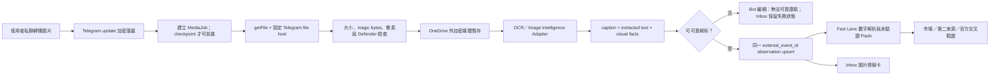

# Telegram Image Fast Lane v2.0.1 更新計畫

日期：2026-08-03（預定執行）
狀態：Plan only；2026-08-02 未修改 production code、資料 schema 或 runtime state。

## 1. 已確認的問題

這不是 Telegram Bot API 漏掉圖片，而是目前 connector 的既定安全行為：

- `messageText()` 只讀取 `message.text` 或 `message.caption`。
- `attachmentKinds()` 能辨認 `photo`，但 observation 固定寫入 `attachment_downloaded: false`。
- 沒有 caption 的圖片只會變成 `[Attachment omitted: photo]`。
- Fast Lane 只把 `observation.summary` 送進 `parseEconomicRelease()`，因此看不到圖上的 CPI、財報數字、圖表與圖片文字。
- 現有測試明確鎖定「never downloads attachments」，必須更新契約，而不是繞過測試。

## 2. 本次目標與邊界

### P0：明天必交付

- 支援已配對使用者在 Bot 私聊中「明確轉傳」的單張 Telegram photo。
- 同時支援以 image document 傳送的 JPEG、PNG、WebP；其他 MIME fail closed。
- 圖片經安全下載、類型／大小檢查、Defender 掃描、OCR／視覺文字抽取後，才進入 Fast Lane 與 Inbox。
- caption 與圖片抽取結果合併，但分別保留 provenance。
- Bot 先回覆「圖片已收到，處理中」，成功後編輯同一則訊息；不以多張通知轟炸使用者。
- 圖片解析失敗時明確回覆原因，不猜測數字、不建立假情報。
- 正式 intelligence 只保存衍生文字、hash、來源與可信度；原始圖片只在 OneDrive 外短期保存。

### 本次不做

- 不下載私人群組 ambient sensor 的任何媒體。
- 不處理影片、動畫、語音、貼圖、PDF 或多頁文件。
- 不自動打開圖片或 caption 內的 URL。
- 不因圖片單一來源进入 `Known`、修改正式路徑機率、建立 Mission 或觸發交易。
- 不部署、不公開 port、不推送到任何託管站點。

### P1：P0 穩定後

- 以 `media_group_id` 合併 Telegram 圖片 album。
- 圖表結構化理解：座標、時間區間、系列名稱、關鍵點位與可疑截圖裁切。
- 圖片翻譯、表格抽取、相似圖片聚類與來源績效。

## 3. 新資料流



## 4. 媒體契約

Observation 的 canonical identity 維持：

`telegram:{chat_id}:{message_id}`

新增的 `payload.media` 只保存安全 metadata，不保存 Bot token、可下載 URL 或任意檔案路徑：

```json
{
  "kind": "photo",
  "state": "queued | scanned | extracted | rejected | failed | expired",
  "file_unique_id": "telegram-stable-id",
  "content_sha256": "sha256-after-download",
  "mime_type": "image/jpeg",
  "bytes": 123456,
  "width": 1280,
  "height": 720,
  "caption_present": false,
  "analysis_method": "local_ocr | vision_adapter",
  "analysis_version": "adapter-version",
  "extraction_confidence": 0.91,
  "ocr_languages": ["eng", "chi_tra"],
  "retention_expires_at": "ISO-8601"
}
```

衍生內容分三層，禁止混成一段不明來源摘要：

- `caption_text`：Telegram 原 caption。
- `extracted_text`：OCR 逐字結果，標示機器抽取。
- `visual_summary`／`structured_claims`：圖片理解後的摘要與欄位，逐欄附 confidence。

只要結構化數值的欄位信心不足，Fast Lane 就不得輸出 actual／forecast／previous。

## 5. 下載與安全設計

- 只有 `telegram.explicit-submit` 且已通過 bot/chat/user allowlist 的私聊圖片可建立 MediaJob。
- 從 `message.photo[]` 選取解析度最高且符合政策的 `PhotoSize`；圖片文件只接受 JPEG、PNG、WebP。
- 使用 Bot API `getFile`；下載 host、protocol 與 path 由 connector 組合，不接受訊息提供的 URL。
- Alpha 應用上限 10 MB，雖然 Telegram Bot API 的下載上限較高；宣告長度與實際串流 bytes 都要檢查。
- 限制解碼後像素總量，防止 decompression bomb；MIME 宣告必須與 magic bytes 一致。
- 下載到 `.part`，完成 hash 與 Defender scan 後才原子 rename；scan、類型或大小失敗即隔離／刪除。
- 原始圖片存於 `%LOCALAPPDATA%\IntelOS\encrypted-telegram-media`，禁止進 OneDrive、Git、Markdown、localStorage 或 log。
- 媒體以 AES-256-GCM 串流加密，單檔 key 再由 Windows DPAPI CurrentUser 包裝，避免把大圖片直接塞進現有 DPAPI Base64 helper。
- 成功抽取後原圖預設 1 小時刪除；失敗 quarantine 最長 24 小時。`/forget`、`/forgetme` 必須同步清除圖片、key、thumbnail 與衍生結果。
- 前端若顯示縮圖，只能透過 opaque media id 的 localhost endpoint 短期讀取；client 不得提交 filesystem path。

## 6. 圖片理解策略

新增可替換 `ImageIntelligenceAdapter`，避免 connector 綁死單一 OCR 或模型：

```js
analyzeImage({ encryptedMediaId, caption, languagesHint }) => {
  extracted_text,
  visual_summary,
  structured_claims,
  field_confidence,
  warnings,
  method,
  version
}
```

明天先做環境 preflight：以使用者實際轉傳的同一張圖片測試本機 Windows OCR 的繁中／英文／日文與數字準確度。通過門檻才作為 P0 adapter；若不可用或準確度不足，保留 adapter 與安全下載，但 fail closed，不用低品質 OCR 假裝完成。再評估本機 OCR 套件或需明確授權的 vision provider；未確認前不把圖片傳到雲端。

對財經快訊圖片，優先抽取：

- 指標名稱與期間。
- actual／forecast／previous／revision。
- 單位與正負號。
- 圖片中的來源名稱、時間戳與發布時間。
- OCR 矛盾、裁切不完整或疑似舊圖警告。

## 7. Bot 與 UI 行為

### Telegram

1. Durable MediaJob 完成後回覆：`已收到圖片，正在讀取；來源仍未驗證。`
2. 成功：編輯同一則回覆，顯示中文要點、抽取數值、confidence、來源與驗證狀態。
3. 低信心：`圖片已收到，但無法可靠提取數值`，並列出缺失欄位。
4. 拒絕：顯示類型／大小／安全檢查原因，不暴露內部路徑。

### Dashboard

- Live Pulse 卡顯示 `IMAGE`、`OCR/視覺解析`、`UNVERIFIED` 與處理狀態。
- 保留原 caption 與機器抽取的視覺區隔。
- 有合法暫存時可展開縮圖；過期後顯示「原圖已清除，衍生摘要保留」。
- 图片中的 release 數字只有在字段 confidence 達門檻時才進 Flash；否則只留 Inbox candidate。

## 8. 預定修改位置

- `server/connectors/telegram.mjs`
  - 建立 media descriptor、選取 photo、MediaJob durable handoff。
  - 保持 group sensor metadata-only。
- `server/connectors/telegram-media.mjs`（新增）
  - `getFile`、受限串流下載、驗證、掃描與 analyzer orchestration。
- `server/connectors/encrypted-media-store.mjs`（新增）
  - AES-GCM blob、DPAPI-wrapped key、retention、forget 與 atomic write。
- `server/runtime-boundary.mjs`
  - 加入 `encrypted-telegram-media` 與 media quarantine，沿用 junction/reparse 防護。
- `server/runtime.mjs`
  - 注入 MediaJob worker；處理完成後 upsert 同一 observation、更新 Bot 與 SSE。
- `server/forward-intelligence/engine.mjs`
  - 接受帶 field confidence 的 extracted claim；低信心 fail closed。
- `server/api/router.mjs`
  - 如需要縮圖，新增 opaque-id localhost read endpoint；不得接受 path。
- `app/page.tsx`、`app/globals.css`
  - 圖片處理／失敗／已清除狀態與 provenance UI。
- `tests/connectors.test.mjs`
  - 將舊的「never downloads attachments」拆成「ambient 不下載、explicit image 才受控下載」。
- `tests/forward-intelligence.test.mjs`、`tests/runtime.test.mjs`
  - 圖片 claim、同訊息 upsert、Bot edit、retention、forget 與安全失敗。
- `README.md`
  - 更新媒體邊界、保存期限與使用者資料處理說明。

## 9. 明天執行順序

1. 先保存目前工作樹狀態並跑 Telegram／Fast Lane baseline。
2. 加入失敗測試：photo-only forward 目前不得再變成 omitted placeholder。
3. 實作 MediaDescriptor、選圖與 durable MediaJob，不接 analyzer。
4. 實作受限下載、hash、magic bytes、Defender、加密 store 與 purge。
5. 完成本機 OCR capability／準確度 preflight，接入可用 adapter。
6. 串接 observation upsert、Fast Lane confidence gate 與 Bot message edit。
7. 加入 Dashboard 狀態與短期 thumbnail。
8. 跑 unit、integration、build、lint；修正後用實際 Bot 做單張圖 shadow test。
9. 確認原圖自動清除與 `/forgetme` 後，再啟用日常使用。

## 10. 必過驗收

- 純圖片 forward 不再產生 `[Attachment omitted: photo]` 作為最終情報內容。
- 有 caption 的圖片同時保留 caption 與圖片抽取結果，且 provenance 不混淆。
- Bot 在 durable enqueue 後快速確認收到；OCR 不阻塞 checkpoint，也不造成重複卡。
- 同一 update 重試、edited caption 或重啟後只 upsert 同一 `external_event_id`。
- 高信心 CPI 圖片可進 `unverified Flash`；低信心圖片不得猜數字。
- Telegram 單一圖片不能進 Known、改正式機率、建 Mission 或交易。
- 未授權 chat/user、群組 ambient photo、其他 bot、匿名 sender 永不下載。
- 超限、偽 MIME、截斷、惡意或 Defender 命中檔案 fail closed。
- Bot token、`file_id`、下載 URL、chat path 與本機路徑不出現在 log、Markdown、API 或 UI。
- 原圖、thumbnail、key 與 derived cache 會依 retention 或 `/forget*` 完整清除。
- PC 離線或 analyzer unavailable 時顯示 coverage／processing gap，不宣稱圖片已讀取。
- 既有 Telegram、Fast Lane、安全、store 與 UI 測試全部保持通過。

## 11. Go / No-Go

只有同時符合以下條件才啟用：

- 實際 Telegram 單圖 forward 成功。
- 至少三種 fixture 通過：純圖片數字快訊、圖片加 caption、無關圖片。
- 數值欄位沒有低信心誤報。
- 加密暫存、retention 與 `/forgetme` 實測完成。
- Group sensor 的媒體仍保持不下載。

任一安全／刪除測試失敗，或 OCR 把關鍵數字讀錯卻仍產生 Flash，均為 No-Go；保留文字 Fast Lane，圖片路徑維持 disabled。
